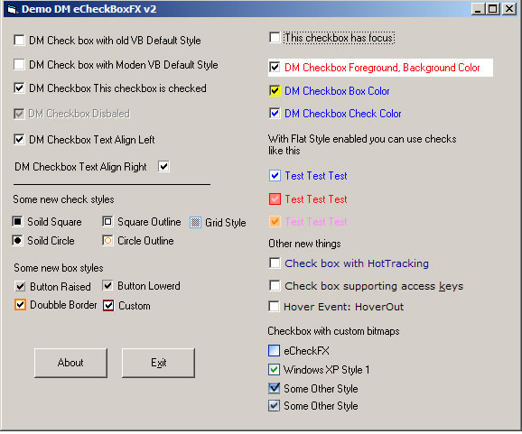



## DM eCheckBoxFX v2 Update

### Description

Hi This is a new update of my custom checkbox, now supports HotTracking, Custom Bitmaps,More check styles, Access Key support, and lots more please vote.
 
### More Info
 

             |
---                |---
**Submitted On**   |2003-02-14 15:25:30
**By**             |[dreamvb](https://github.com/Planet-Source-Code/PSCIndex/blob/master/ByAuthor/dreamvb.md)
**Level**          |Intermediate
**User Rating**    |4.8 (57 globes from 12 users)
**Compatibility**  |VB 5\.0, VB 6\.0
**Category**       |[OLE/ COM/ DCOM/ Active\-X](https://github.com/Planet-Source-Code/PSCIndex/blob/master/ByCategory/ole-com-dcom-active-x__1-29.md)
**World**          |[Visual Basic](https://github.com/Planet-Source-Code/PSCIndex/blob/master/ByWorld/visual-basic.md)
**Archive File**   |[DM\_eCheckB1923248122005\.zip](https://github.com/Planet-Source-Code/dreamvb-dm-echeckboxfx-v2-update__1-62116/archive/master.zip)

